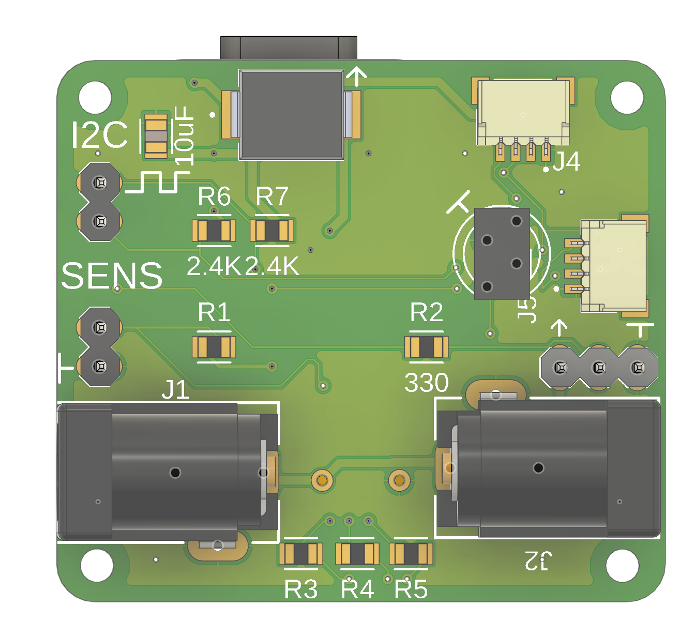
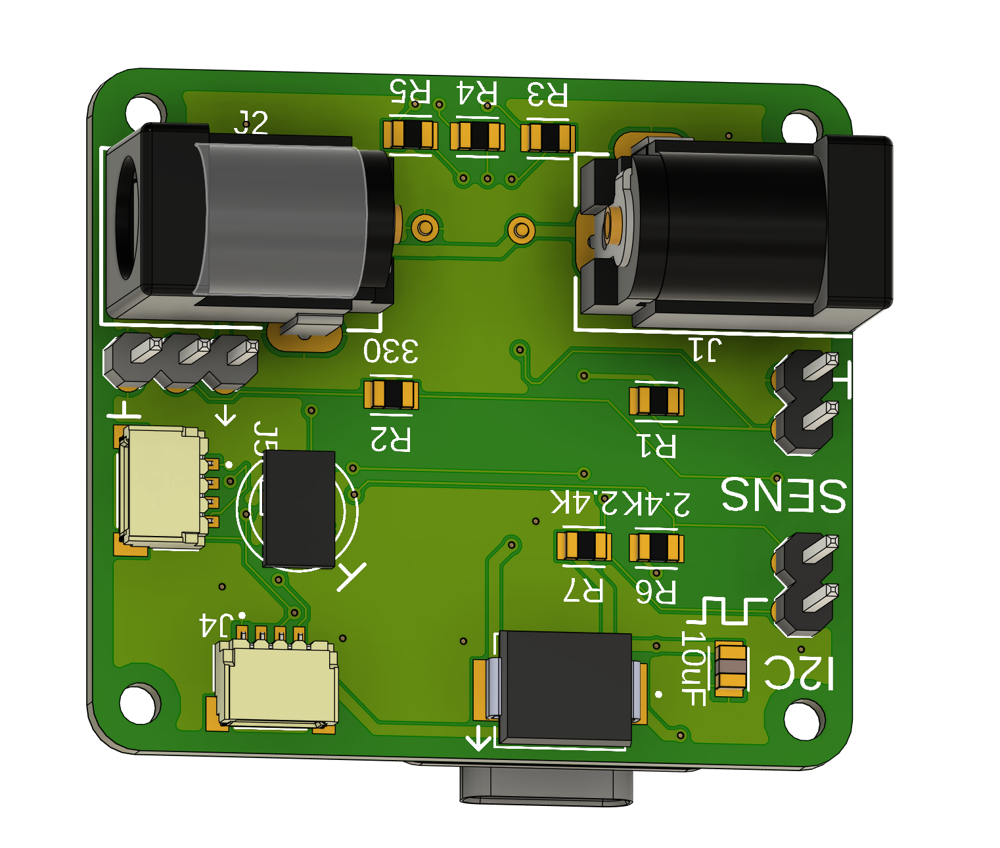

# SmartHome Monitor — An Expandable Environmental Sensing Platform

A custom PCB and firmware suite for indoor environmental monitoring, designed as a general-purpose base platform that scales from a single temperature/humidity node to a multi-modal sensing hub with expansion pathways for actuation and display.

<p align="center">
  
  
</p>

## Motivation

A common failure mode in hobbyist environmental sensing is the "one-off breadboard" — a working prototype that never survives its own prototyping stage, because moving to a permanent installation requires redesigning the electrical, mechanical, and firmware layers simultaneously. This project treats those three layers as a single co-designed system, with the explicit goal of producing a base platform reusable across future projects rather than a single-purpose device.

The design started from a working breadboard prototype using an Arduino Nano 33 IoT and a DHT11 streaming to Arduino Cloud. Three constraints motivated the redesign: the DHT11's ±2°C accuracy and 1°C resolution required elaborate software compensation to detect HVAC state transitions; the free Arduino Cloud tier limited retention and dashboarding to the point that Adafruit IO became preferable; and the breadboard form factor precluded permanent installation. The resulting board addresses all three while adding a documented expansion path for the sensing modalities and display peripherals I intend to add later.

## Repository structure

```
SmartHome-Monitor/
├── README.md                       — this file
├── LICENSE
├── CHANGELOG.md
├── .gitignore
├── docs/
│   ├── design-rationale.md         — component selection reasoning
│   ├── power-architecture.md       — dual-input power strategy
│   ├── assembly-guide.md           — hand-solder walkthrough
│   ├── enclosure-design.md         — 3D-printed housing with dovetail mount
│   └── images/                     — renders, schematics, photos
├── hardware/
│   ├── schematic.pdf               — full electrical schematic
│   ├── BOM.csv                     — bill of materials with sources
│   ├── pcb_images/                 — top/bottom PCB renders
│   └── enclosure/                  — STL files (WIP)
└── firmware/
    ├── secrets_example.h           — credential template
    ├── level1_basic_monitor/       — BME280 → Adafruit IO
    ├── level2_hvac_inference/      — slope-based HVAC state detection
    ├── level3_expandable_platform/ — Qwiic + thermistor + light sensor
    └── level4_future_spotify_display/ — planned WS2812B integration
```

## Project tiers

The firmware is organized as four progressive tiers, each a working codebase demonstrating a distinct level of hardware-software integration. This structure mirrors the pedagogical approach I intend to use as a TA — build the minimum viable version first, then add complexity only where it earns its keep.

### Level 1 — Basic environmental monitor

BME280 read over I2C, published to Adafruit IO at a fixed interval. Approximately 60 lines of code. This is the "does the hardware work end-to-end" checkpoint. See [`firmware/level1_basic_monitor/`](firmware/level1_basic_monitor/).

### Level 2 — HVAC state inference

Adds temperature slope regression over a rolling window to infer whether HVAC is currently heating, cooling, or idle. Includes dead-zone hysteresis to prevent false transitions from noise. Demonstrates that the sensor upgrade from DHT11 to BME280 enables inference the original hardware could not support. See [`firmware/level2_hvac_inference/`](firmware/level2_hvac_inference/).

### Level 3 — Multi-modal expandable platform

Extends Level 2 with a Qwiic sensor discovery routine, an ambient light channel via VEML7700, and an analog thermistor input for the resistive divider. Structured so that adding a new I2C sensor requires modifying a single function. See [`firmware/level3_expandable_platform/`](firmware/level3_expandable_platform/).

### Level 4 — Spotify album-art display (future work)

Reuses the same PCB with a WS2812B 22×22 matrix connected via the 3-pin JST connector. OAuth 2.0 flow against Spotify's Web API, JPEG decode, and downsample to 22×22. Documented as a roadmap because the OAuth and TLS overhead is substantially more implementation work than the sensing tiers. See [`firmware/level4_future_spotify_display/`](firmware/level4_future_spotify_display/).

## Hardware summary

| Attribute | Value |
|---|---|
| MCU | Seeed XIAO ESP32-C3 (RISC-V, 160 MHz, WiFi + BLE) |
| Primary sensor | BME280 (I2C, external via Qwiic) |
| Board dimensions | ~50 × 45 mm (2.25 in²) |
| Power inputs | Dual 5.5×2.1mm barrel jacks (5V logic, 5V matrix) |
| Expansion | 2× SparkFun Qwiic (JST-SH), 1× 3-pin JST-SM (WS2812B), 2-pin thermistor header, breadboard-friendly I2C THT pads |
| Enclosure | FDM-printed two-piece housing with dovetail wall mount |

Full component list, source, and rationale in [`hardware/BOM.csv`](hardware/BOM.csv) and [`docs/design-rationale.md`](docs/design-rationale.md).

## Getting started

1. Print the enclosure files from `hardware/enclosure/` — see [`docs/enclosure-design.md`](docs/enclosure-design.md) for orientation.
2. Order the PCB from Gerber files (not in this repo — export from your CAD tool of choice) and assemble per [`docs/assembly-guide.md`](docs/assembly-guide.md).
3. Connect a BME280 breakout (Adafruit or SparkFun Qwiic) to J3 or J4.
4. Copy `firmware/secrets_example.h` to `firmware/secrets.h` and populate with your WiFi and Adafruit IO credentials. **This file is gitignored — never commit it.**
5. Open `firmware/level1_basic_monitor/level1_basic_monitor.ino` in Arduino IDE, select "XIAO_ESP32C3" as the board, upload.

## Design decisions worth reading

Three choices deserve their own discussion, all documented separately:

- **Why the XIAO ESP32-C3 over the QT Py ESP32-S3.** See [`docs/design-rationale.md`](docs/design-rationale.md#mcu-selection). Short version: the C3's single-core RISC-V is sufficient for the sensing workload, and the ~$8 cost delta compounds across a repeat-build platform.
- **Why two barrel jacks instead of one.** See [`docs/power-architecture.md`](docs/power-architecture.md). Short version: isolating the WS2812B matrix's up-to-5A pulsed current draw from the sensor rail preserves analog measurement quality.
- **Why the enclosure uses a dovetail rather than screws.** See [`docs/enclosure-design.md`](docs/enclosure-design.md). Short version: one-handed removal for firmware iteration without disturbing the wall-mounted power/network connections.

## License

MIT. See [`LICENSE`](LICENSE).

## Author

Yash Patel. Firmware and hardware co-design as a portfolio artifact for a graduate teaching assistantship in undergraduate senior capstone design.
